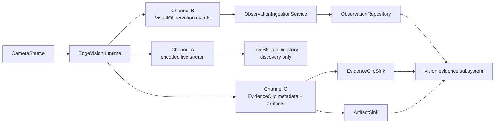

# Edge device / Home Cortex V1 interface

## Decision

EdgeVision is a producer process with three independent capabilities over one
camera source. It may expose live video, publish compact observations, and create
evidence clips at the same time. Each capability can start, fail, reconnect, or
be disabled without changing the other two.

Home Cortex consumes the contracts in [`contracts.py`](contracts.py) through the
transport-neutral ports in [`ports.py`](ports.py). The Mac development runtime
and future MicroDuck runtime must use those same ports. Replacing
`MacCameraSource` with `MicroDuckCameraSource` changes deployment configuration,
device credentials, and producer profile records; it does not change observation,
clip, ingestion, candidate, enrollment, or household contracts.



## Responsibility matrix

| Responsibility | Edge device | Home Cortex |
|---|---|---|
| Camera driver, capture, source timestamp | Owns | Does not access camera |
| Raw frames and rolling buffer | Owns; bounded and ephemeral | Never receives unrequested raw frames |
| Live encoding and media transport | Owns | Discovers endpoint and reports availability |
| Detector, tracker, suppression/deduplication | Owns | Receives normalized admitted events |
| Detector-native to canonical adapter | Owns at its egress boundary | Rejects native fields during validation |
| Observation ID creation and retry spool | Owns | Enforces atomic idempotency |
| Observation contract and validation | Produces it | Owns and validates it |
| Observation receipt time and persistence | Does not author | Owns |
| Clip selection, rolling-buffer extraction, encoding | Owns | Does not encode media |
| Artifact bytes | Uploads through `ArtifactSink` | Registers/resolves external storage |
| Clip metadata and state rules | Publishes transitions | Owns durable state and validates transitions |
| Candidate lifecycle, review, enrollment | May compute hypotheses | Owns candidates and human confirmation |
| Spatial observations/localization | May produce Epic 1 values | Validates and stores optional evidence enrichment |
| Household reconciliation and history/query | Does not mutate household facts | Owns explicit reconciliation and queries |

The edge may deduplicate high-frequency detections before emitting observations.
Home Cortex may later apply retention or admission policy, but an acknowledged
V1 observation must have a durable outcome. An observation ID/content-hash ledger
must survive at least the producer retry horizon even if the full observation is
later expired, otherwise an old retry could be inserted again.

## Channel A: live stream

The edge terminates the human-facing encoded stream. In V1, Home Cortex stores or
resolves a short-lived `LiveStreamAdvertisement` containing source, transport,
endpoint, and optional expiry. A client connects to the edge endpoint directly.
Home Cortex does not proxy media, terminate WebRTC, transcode frames, or own viewer
sessions.

The existing Mac MJPEG server is one development implementation. MicroDuck may
advertise RTSP, WebRTC, or another encoded transport without changing channels B
or C. If deployment networking later requires a gateway, that gateway implements
the live-media path and directory contract; it does not enter the visual domain.

Stream discovery and stream health are advisory. An unavailable stream neither
invalidates existing observations nor prevents structured ingestion or clip
delivery.

## Channel B: observation events

V1 should use a small HTTP adapter because it is easy to operate and replay.
The recommended request is an NDJSON body (`application/x-ndjson`) at a dedicated
visual-ingestion endpoint. Each nonblank line is exactly one canonical
`VisualObservation` mapping. A bounded JSON array may be supported by the same
adapter, but both representations call `ObservationIngestionService.ingest` for
each item.

The response contains one result per observation:

```json
{
  "results": [
    {
      "observation_id": "visual_observation:018f...",
      "disposition": "accepted",
      "received_at": "2026-09-14T20:31:12.123+00:00"
    }
  ]
}
```

HTTP is an adapter choice. A WebSocket, message stream, or future robot transport
must pass the decoded mapping to the same service and return the same per-record
disposition. No transport header or connection state belongs in
`VisualObservation`.

### Delivery guarantee and IDs

V1 uses **at-least-once delivery with idempotent ingestion**:

1. The edge generates a globally unique `visual_observation:` ID before the first
   send. UUIDv7 is recommended; the ID is retained unchanged across retries and
   replay. It is never derived from a hostname, IP address, category, or box.
2. The edge writes the canonical payload to a small local retry spool before
   sending. It removes an entry only after `accepted` or `duplicate`.
3. Home Cortex validates and canonically serializes the observation, then hashes
   that canonical content.
4. `ObservationRepository.put_if_absent` performs one atomic decision keyed by
   observation ID: absent becomes `accepted`; same ID and hash becomes
   `duplicate`; same ID with different hash becomes `conflict`.
5. The backend acknowledges only after the durable decision. A conflict is
   quarantined and investigated; the producer must not overwrite either value.

Connection loss before an acknowledgement causes a retry. After reconnect, the
edge sends unacknowledged spool entries in any order. Home Cortex accepts
out-of-order observations and never uses arrival order to rewrite source time.
Batches have per-record results; one invalid or conflicting line does not make
successfully persisted siblings ambiguous. Malformed input is a non-retryable
contract error until corrected.

## Timestamp and clock strategy

All wire timestamps are timezone-aware ISO-8601 values; UTC is preferred. Clock
ownership is explicit:

| Field | Authoritative clock | Meaning |
|---|---|---|
| `CameraFrame.captured_at` | Edge device | Frame capture/exposure time available to the source |
| `VisualObservation.captured_at` | Edge device | Capture time of the visual evidence used for this observation |
| `VisualObservation.observed_at` | Edge device | Time the edge finalized the structured observation; cannot precede capture |
| `ObservationIngestRecord.received_at` | Home Cortex | Time this delivery attempt reached the shared ingestion service |
| `EvidenceClip.start_time` / `end_time` | Edge device | Capture interval represented by the clip |
| `EvidenceClip.requested_at` | Clip requester | Time clip creation was requested |
| `EvidenceClip.resolved_at` | Component resolving the job | Time bytes became available or terminal failure was declared |

The backend never replaces missing source timestamps with `received_at` and never
rewrites them to hide clock skew. Devices should synchronize clocks, but cross
device ordering is only as reliable as that synchronization. `received_at` is
useful for transport delay and operational diagnosis; it is not evidence time.
Retries get new receipt times while the repository preserves the first accepted
record and its first receipt metadata.

## Device and producer identity

`device_id` and `camera_id` are provisioned stable record IDs. The source pair
identifies the physical sensor path:

```text
device:dev_macbook   + camera:built_in
device:microduck_01  + camera:front
```

Neither value comes from an IP address, DNS name, interface name, USB index, or
process hostname. Reimaging a device keeps its provisioned device ID; replacing
physical hardware receives a new ID. Camera IDs are stable configuration IDs and
do not use driver enumeration indexes.

Transport authentication must bind a credential to its allowed device ID and
reject a payload claiming another device. Model and pipeline identity remain in
the referenced immutable `vision_producer:` profile. Changing detector weights
creates a new producer profile, not a new physical device.

## Channel C: evidence clips

Clip metadata and artifact bytes use separate ports. This avoids sending large
media through the observation channel and preserves the Ticket 1 invariant that
observations do not depend on clips.

The V1 sequence is:

```text
observation accepted
    -> edge publishes EvidenceClip(state=pending, observation_ids=[...])
    -> edge extracts/encodes from its rolling buffer
    -> edge uploads bytes through ArtifactSink
    -> ArtifactSink returns ArtifactReference
    -> edge publishes EvidenceClip(state=available, artifact=..., resolved_at=...)
```

On a terminal encoder, buffer, or upload error, the edge publishes `failed` with
a stable machine-readable `failure_code` and `resolved_at`. A simple Home Cortex
timeout sweep may turn an overdue `pending` record into `failed` with
`failure_code=clip_timeout`. No distributed task queue is required: the edge owns
the work and local retry spool; Home Cortex owns only state validation and durable
metadata.

Clip creation and transitions are idempotent. The first record must be `pending`.
While pending, associated observation IDs may grow but cannot be removed; source,
request time, and clip window cannot change. The only terminal transitions are
`pending -> available` and `pending -> failed`. Repeating an identical state is a
duplicate acknowledgement. Terminal states cannot change. A late upload after a
timeout is rejected; the edge may retry under a new clip ID if the evidence is
still available.

Artifact bytes are committed before `available` metadata. Upload by content hash
is naturally idempotent. Orphaned uploads are garbage-collected after a grace
period, and artifact deletion never deletes an observation.

## Replay

Replay is an observation source adapter, not a second ingestion implementation:

```text
observations.jsonl
    -> parse_observations_jsonl
    -> ObservationIngestionService.ingest
    -> ObservationRepository.put_if_absent
```

It needs no camera, detector, tracker, Mac runtime, MicroDuck, or original media.
It preserves observation IDs, source timestamps, device/camera IDs, and producer
profile references. Replaying the same file returns `duplicate`; changed content
under an existing ID returns `conflict`. A replay package should register its
referenced immutable producer profiles before observations, but the observation
path itself is identical to live ingestion.

## Exact implementation seams for Grok

Implement these seams without importing transport libraries into
`vision.contracts` or `vision.ports`:

### EdgeVision

1. Keep `CameraSource.open/read/close`; implement `MicroDuckCameraSource` with the
   same `CameraFrame(captured_at, width, height, jpeg)` output.
2. Add a detector adapter that accepts native results and emits validated
   `VisualObservation`. Generate the stable ID before spooling and set
   `captured_at` from the frame, then `observed_at` when the observation is built.
3. Add an `ObservationPublisher` transport adapter with a bounded disk spool,
   retry/backoff, and per-record acknowledgement handling. It depends on the
   `ObservationSink` behavior, not Home Cortex storage details.
4. Keep one bounded encoded-frame rolling buffer per source. Add a clip worker
   that publishes `pending`, extracts the requested window, writes through
   `ArtifactSink`, and publishes one terminal transition through
   `EvidenceClipSink`.
5. Expose a `LiveStreamAdvertisement` from the existing stream server. Do not
   route observation JSON or artifact upload through the MJPEG handler.

### Home Cortex

1. Implement `ObservationRepository.put_if_absent` in SurrealDB with an atomic
   unique-ID/content-hash decision. Persist first `received_at`; log later attempts.
2. Add a thin authenticated HTTP NDJSON adapter over
   `ObservationIngestionService`. Enforce payload and batch limits and return one
   disposition per input line.
3. Implement `EvidenceClipSink` over a repository that calls
   `evaluate_evidence_clip_write` transactionally before insert/update.
4. Implement `ArtifactSink` using the configured artifact store. Verify the hash,
   MIME type, and byte length before returning `ArtifactReference`.
5. Implement `LiveStreamDirectory` as short-lived device capability metadata.
   Do not add video bytes or session state to the semantic API process.
6. Add a replay CLI whose file reader calls `replay_jsonl` or streams each parsed
   line to the same ingestion service. It must not instantiate EdgeVision.
7. Keep candidate promotion, review, enrollment, reconciliation, and history/query
   as downstream consumers of accepted evidence. None belongs in a transport
   handler.
