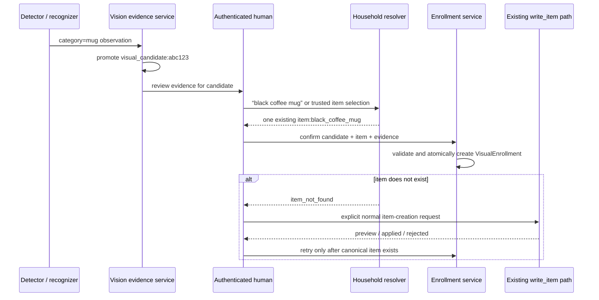

# Human-guided visual enrollment and identity semantics

## Decision

Home Cortex keeps four identity levels in separate fields and records. A detector
category is class evidence, a visual candidate is a durable evidence anchor, an
item hypothesis is a scored machine proposal, and a visual enrollment is the
auditable human authority that links visual evidence to an existing household
item. None of these values changes household facts.

`VisualEnrollment` attaches one persistent `VisualCandidate` to one existing
canonical `item:` and cites one or more source observations. It does not attach
to an edge track because tracks end with the perception session. It does not
attach to an embedding profile because embeddings are derived, model-versioned
artifacts. The candidate is the stable identity anchor; the observation set is
the human-reviewed evidence supporting that association.

## Identity levels

| Level | Canonical representation | Authority | Meaning |
|---|---|---|---|
| Category | `VisualObservation.detector_belief.category` | Detector | The image region resembles a generic class such as `mug` |
| Visual candidate | `visual_candidate:abc123` and `candidate_hypotheses` | Home Cortex evidence subsystem plus recognizer score | Observations may depict the same persistent visual instance |
| Machine-proposed household identity | `item_hypotheses[]` with `item_id`, score, and supporting enrollment IDs | Recognizer | Current evidence resembles representations grounded by cited enrollments |
| Human-confirmed canonical identity | Active `VisualEnrollment(candidate_id, item_id, ...)` | Authenticated human | The reviewed visual candidate is associated with an existing household item |

There is deliberately no `identity` or `canonical_item_id` field on an
observation or candidate. The three uncertain forms retain their origin and
score. The human-confirmed form retains its actor, time, and evidence independently
of mutable candidate review state.

An `item_hypothesis` must cite at least one `visual_enrollment:`. The ingestion or
recognition service must also verify that the cited enrollment is active and
identifies the proposed item. The contract-level type check prevents an
ungrounded item proposal; the repository check prevents a stale or mismatched
one. An item hypothesis remains evidence even when its confidence is high. It
does not become a confirmation and does not update an enrollment. Each target
appears at most once in its hypothesis list, and scores are interpreted only in
the context of the observation's immutable producer profile.

## Enrollment contract

```text
VisualEnrollment
  id: visual_enrollment:...
  candidate_id: visual_candidate:...
  item_id: item:...
  confirmed_at: server-authored timestamp
  confirmed_by: authenticated person:...
  evidence_observation_ids: [visual_observation:..., ...]
  label_text: optional human wording for audit/display
  state: active | revoked
  revoked_at: required only when revoked
  revoked_by: required only when revoked
```

`label_text` records what the reviewer called the object when useful, but it is
not resolved identity and must never override `item_id`. The application service,
not a client payload, supplies `confirmed_by` from authenticated context and
`confirmed_at` from the backend clock.

Enrollment creation is one transactional application operation with these
preconditions:

1. The candidate exists and is `active`.
2. Every cited observation exists and is admissibly associated with that
   candidate as seed evidence or a candidate hypothesis.
3. The item exists in the caller's household scope and resolution produced one
   unambiguous canonical item.
4. The confirming person is authenticated and authorized for that household.
5. The candidate has no active enrollment. A repeated identical request is
   idempotent; a different active item is a conflict.

The service inserts an active enrollment atomically with the uniqueness check.
Correcting identity revokes the old enrollment and creates a new record; it does
not edit the original item ID in place. Revoked records remain available for
audit. Multiple candidates may temporarily enroll to the same item because
separate tracks can rediscover one object; `item_id` therefore has no uniqueness
constraint.

## Candidate lifecycle and duplicates

The minimal V1 candidate states are:

| State | Meaning | Allowed next state |
|---|---|---|
| `active` | Available for recognition and human review, whether enrolled or not | `ignored`, `merged`, `expired` |
| `ignored` | A human chose not to review or retain it as an identity candidate | `active`, `expired` |
| `merged` | A human selected another candidate as the surviving duplicate | Terminal |
| `expired` | Retention removed it from active use after references were handled | Terminal |

“Confirmed” is not a candidate state. Whether a candidate is confirmed is a
derived view over active enrollments. This avoids losing the confirming actor and
evidence when candidate metadata changes.

V1 supports manual merge only. Similarity clustering may rank possible duplicate
pairs for review, but it must not merge them. Candidate IDs do not assert that
two candidates are different physical objects.

A merge transaction sets the losing candidate to `merged` and records the active
survivor in `merged_into_candidate_id`. It must reject cycles and a survivor that
is not active. If both candidates have active enrollments for different items,
the merge is blocked for human conflict resolution. If both identify the same
item, the service may preserve one active enrollment and revoke the redundant
one in the same transaction, retaining both histories and evidence sets.

## Human confirmation flow



A trusted UI selection may submit a canonical item ID after household-scoped
authorization. Free text must use deterministic household resolution. In the
current codebase, named resolution is compiled as `resolve_reference` and
executed by `HouseholdFactEngine`; `NamedItemWritingService` uses the same route
before delegating mutations to `ItemWritingService`.

If resolution returns not found, ambiguous, or rejected, enrollment stops. When
the user wants a new item, the ordinary semantic mutation route must produce a
`NamedCreateItem` and dispatch `write_item`. `NamedItemWritingService` resolves
the destination and `ItemWritingService` enforces the ontology, edge schema,
preview/commit mode, and fixed SurrealDB transaction. The current create contract
requires a destination, so the conversation asks for one if it is absent. Visual
position evidence must not silently fill that field.

Only after the normal write returns an applied canonical item does the caller
retry enrollment. `WriteRequest` and `CreateItemRequest` remain internal
household-write values; the vision package does not construct them. The vision
package never invokes SurrealQL or a repository mutation for an item.

## Multi-view and future recognition

One enrollment can cite multiple observations from different times, cameras, or
viewpoints. This is sufficient for V1 multi-view enrollment without making an
embedding a domain identity. Crops and embedding artifacts remain attached to
their observations through storage-neutral `ArtifactReference` values and retain
model provenance through `ProducerProfile`.

A future recognition pipeline follows this relationship:

```text
new crop
  -> versioned embedding artifact
  -> nearest enrolled visual representations
  -> supporting active VisualEnrollment records
  -> scored HouseholdItemHypothesis
```

It may use several observations and several enrollment records for one item.
Changing embedding models creates new derived artifacts and a new producer
profile; it does not migrate candidate IDs, edit enrollments, or change household
items. Index storage and vectors are implementation details outside SurrealDB
domain records.

## Canonical household boundary

Enrollment confirms only visual identity. It does not assert that the item
exists at the observation's position, that an estimated space is canonical, or
that household state changed. The following remain separate:

```text
active enrollment       -> human-confirmed visual association
object position estimate -> spatial evidence
located_in edge          -> canonical household fact
```

A later reconciliation service may review identity and spatial evidence and
propose a location mutation through the normal write path. Neither recognition
confidence nor enrollment authority bypasses that decision.

## Prohibited shortcuts

1. Never convert detector category `mug` directly to an `item:`.
2. Never create or modify an enrollment when a score crosses a threshold.
3. Never put an `item_id` on `VisualCandidate` or a confirmed ID on an observation.
4. Never treat candidate state as proof of human confirmation.
5. Never enroll an ephemeral track or an embedding artifact directly.
6. Never create a household item from the vision repository or direct SurrealQL.
7. Never combine missing-item creation and enrollment into one hidden write.
8. Never infer canonical location from confirmation, a bounding box, or a pose.
9. Never rewrite historical observations after enrollment, revocation, or merge.
10. Never auto-merge candidates solely from visual similarity.

## Exact implementation seams for Grok

1. Add a household-owned `CanonicalItemResolution` port to the enrollment
   application service. Back free-text resolution with the existing
   `HouseholdFactEngine` `resolve_reference` behavior; allow a trusted item ID
   only after household-scope authorization.
2. Implement `CandidateRepository` and `EnrollmentRepository` in the vision
   persistence layer. Expose one transactional `create_active` operation that
   checks candidate state, evidence associations, item existence, and active
   enrollment uniqueness.
3. Derive confirmation by querying the active enrollment. Do not cache an item ID
   on the candidate; any read-model cache must invalidate on revoke and merge.
4. Make enrollment creation idempotent with a caller-supplied enrollment request
   ID or stable command ID. Same command and content returns the existing result;
   changed content under the same ID is a conflict.
5. Add a separate review endpoint/command for ignore, reactivate, merge, expire,
   revoke, and confirm. Bind human actor and time on the backend.
6. Implement manual merge transactionally with cycle detection and enrollment
   conflict checks. Similarity output may populate a review queue only.
7. When item resolution returns not found, return a structured
   `canonical_item_required` outcome to the orchestrator. The orchestrator starts
   the existing `write_item` conversation and retries enrollment after `APPLIED`;
   do not make the enrollment service depend on `ItemWritingService`.
8. Validate each `HouseholdItemHypothesis` against its active supporting
   enrollments before persistence. Reject stale, revoked, or item-mismatched
   support rather than dropping the references.
9. Build future embedding indexes from observation artifact references and
   producer profiles. Treat indexes as rebuildable derived state.
10. Keep all records and endpoints in the vision subsystem. Do not add candidate,
    enrollment, detector category, or hypotheses to
    `schemas/semantic/ontology.yaml`.

The end-to-end safe sequence is therefore:

```text
YOLO category belief
  -> immutable observation
  -> active visual candidate
  -> deterministic existing-item resolution
  -> human-created VisualEnrollment
```

Every arrow can stop without fabricating an item, identity, location, or
household mutation.
