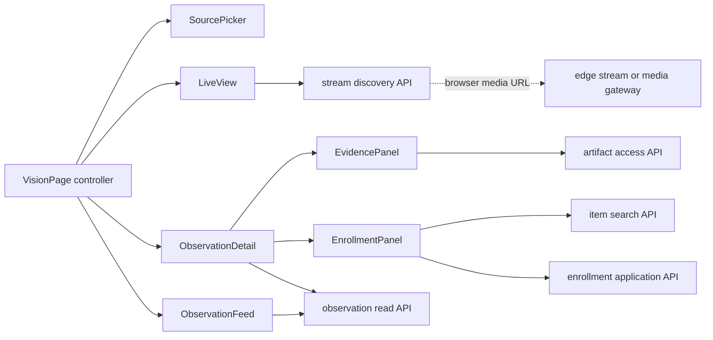
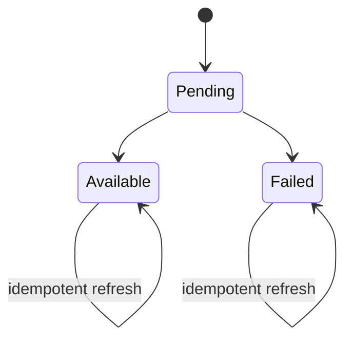

# Vision frontend architecture

## Decision

V1 is one build-free `/vision` page served with the Home Cortex API assets. It
uses plain HTML, CSS, and one ES module because the repository has no frontend
framework or build pipeline and this page needs only selection, polling, media
embedding, search, and form submission. The JSON contracts allow the page to
move into a larger frontend later without changing the vision domain.

The page has three panels: live view, recent observations, and selected evidence
with enrollment. It does not import camera, detector, tracker, artifact-store, or
SurrealDB concepts. All actions go through authenticated application endpoints.



`VisionPage` owns local page state and polling timers. The other names describe
small rendering functions or custom elements, not a component framework. There
is no global store and no client-side router in V1.

## Page and component structure

Recommended assets:

```text
src/home_cortex/vision/web/
  index.html
  vision.css
  vision.js
```

FastAPI serves `index.html` at `/vision` and immutable static assets beneath
`/vision/assets/`. Protect the page and `/v1/vision` routes with the existing API
authentication and identity mapping. Local development can use the current
no-key configuration. A configured deployment should put the page behind the
same identity-aware reverse proxy that supplies the Cortex bearer credential and
mapped user headers to the API. The page must not store the household API key in
JavaScript, local storage, a cookie readable by JavaScript, or a URL. It also must
not contain device addresses or a hard-coded Mac stream URL.

The page controller maintains only:

```text
sources and selected source
observation summaries keyed by observation ID
ordered feed IDs
selected observation ID and current detail
item search query and results
enrollment submission state
poll status and recoverable errors
```

`LiveView` owns the media-element adapter. The feed and review state know only
the selected source and whether playback is available. `ObservationFeed` renders
the newest admitted observations. `ObservationDetail` renders the immutable
observation, crop, clip states, candidate, enrollment, and optional spatial
summary. `EnrollmentPanel` promotes an observation to a candidate when needed,
searches existing items, and submits explicit human confirmation.

On a narrow viewport, the three panels stack in that order. On a desktop they
may use live/feed on the left and selected detail on the right, but the DOM and
state model remain the same.

## Backend transport contracts

These are frontend transport DTOs assembled from canonical vision records. They
are derived views and do not replace `VisualObservation`, `EvidenceClip`,
`VisualCandidate`, or `VisualEnrollment`.

### Source and stream discovery

```http
GET /v1/vision/sources
```

```json
{
  "sources": [
    {
      "source": {
        "device_id": "device:dev_macbook",
        "camera_id": "camera:built_in"
      },
      "source_status": "online",
      "stream_status": "available",
      "playback": {
        "kind": "mjpeg_image",
        "url": "http://127.0.0.1:8088/live.mjpg",
        "expires_at": null
      },
      "last_observation_received_at": "2026-09-15T18:30:04.012Z"
    }
  ],
  "warnings": []
}
```

`source_status` is `online`, `camera_disconnected`, or `offline`.
`stream_status` is independently `available` or `unavailable`. An offline source
can still have a useful historical feed. `warnings` may contain a bounded
operational notice such as `{"code":"observations_rejected","count":2}`; it
never contains a rejected detector payload.

`playback.kind` is a browser adapter name:

| Kind | V1 element | Meaning |
|---|---|---|
| `mjpeg_image` | `` | Current Mac development endpoint |
| `webrtc_embed` | sandboxed `<iframe>` | Browser page exposed by a media gateway |
| `hls` | `<video>` plus a small HLS adapter | Optional connectivity fallback |

The backend creates this browser-facing descriptor from
`LiveStreamAdvertisement`. The page does not receive RTSP URLs. A new media
transport changes only `LiveView` and the descriptor adapter.

### Observation feed

```http
GET /v1/vision/observations?device_id=device%3Adev_macbook&camera_id=camera%3Abuilt_in&limit=50
GET /v1/vision/observations?after=<opaque-ingest-cursor>&limit=50
```

```json
{
  "items": [
    {
      "observation_id": "visual_observation:018f...",
      "captured_at": "2026-09-15T18:30:03.432Z",
      "received_at": "2026-09-15T18:30:04.012Z",
      "source": {
        "device_id": "device:dev_macbook",
        "camera_id": "camera:built_in"
      },
      "category": "mug",
      "confidence": 0.91,
      "thumbnail": null,
      "candidate": {
        "candidate_id": "visual_candidate:abc123",
        "state": "active"
      },
      "enrollment": null
    }
  ],
  "latest_cursor": "opaque",
  "older_cursor": "opaque-or-null"
}
```

The initial response is newest first. Incremental reads use an opaque backend
ingestion cursor rather than `captured_at`, because source events may arrive out
of order. The page upserts summaries by observation ID and keeps its displayed
order stable by capture time plus ID. Pagination for older history uses
`older_cursor`.

`thumbnail`, when available, is an artifact access DTO containing `url`,
`media_type`, and `expires_at`. It is not a storage path. `candidate` is null for
observation-only evidence. `enrollment` is a small active-enrollment summary with
the canonical item ID and display name; model hypotheses are never rendered as
confirmed identity.

### Selected observation

```http
GET /v1/vision/observations/{observation_id}
```

```json
{
  "observation": {
    "id": "visual_observation:018f...",
    "captured_at": "2026-09-15T18:30:03.432Z",
    "observed_at": "2026-09-15T18:30:03.490Z",
    "source": {
      "device_id": "device:dev_macbook",
      "camera_id": "camera:built_in"
    },
    "detector_belief": {
      "category": "mug",
      "confidence": 0.91,
      "bbox": {"x_min": 0.3, "y_min": 0.2, "x_max": 0.5, "y_max": 0.7}
    },
    "producer_profile_id": "vision_producer:mac_v1",
    "track": null,
    "candidate_hypotheses": [],
    "item_hypotheses": [],
    "observer_pose": null,
    "object_position_estimate": null,
    "artifacts": []
  },
  "candidate": {
    "candidate_id": "visual_candidate:abc123",
    "state": "active"
  },
  "enrollment": null,
  "crop": {
    "status": "available",
    "url": "/v1/vision/artifacts/access/opaque",
    "media_type": "image/jpeg",
    "expires_at": "2026-09-15T18:35:04.000Z"
  },
  "clips": [
    {
      "clip_id": "evidence_clip:clip_1",
      "state": "pending",
      "start_time": "2026-09-15T18:29:56.000Z",
      "end_time": "2026-09-15T18:30:11.000Z",
      "playback": null,
      "failure_code": null
    }
  ]
}
```

The observation object uses the canonical mapping unchanged. Candidate,
enrollment, and media access are related read projections. Available crop or clip
access URLs are short-lived, opaque, and resolved by the backend from
`ArtifactReference`; the UI never constructs a filesystem, bucket, or object
store URL. The URL is either a signed artifact-store URL or a same-origin access
endpoint that immediately redirects. The semantic API process does not relay
video bytes.

When `object_position_estimate` is null, the spatial row is omitted or reads
“Position unavailable.” A later non-null estimate can be rendered as space name,
x/y/z, and uncertainty without changing selection or enrollment state.

### Candidate promotion and enrollment

An observation may exist without a candidate. Choosing “Identify object” calls:

```http
POST /v1/vision/candidates
Content-Type: application/json

{
  "command_id": "01K...",
  "evidence_observation_ids": ["visual_observation:018f..."]
}
```

The application service returns the existing candidate for an identical retry or
creates one persistent active candidate. This is a vision operation and does not
touch household facts. If the observation already seeds exactly one active
candidate, the service returns it. Multiple seed owners are a data conflict, and
a scored `candidate_hypothesis` alone is insufficient to select a candidate for
the human.

Existing items are searched through a bounded projection:

```http
GET /v1/vision/items?q=black%20coffee%20mug&limit=20
```

```json
{
  "items": [
    {
      "item_id": "item:black_coffee_mug",
      "display_name": "Black coffee mug",
      "item_type": "mug"
    }
  ]
}
```

The endpoint reuses household-scoped canonical name matching and returns only
fields needed for selection. The browser never supplies a raw query language.

Confirmation calls the Ticket 3 enrollment application service:

```http
POST /v1/vision/enrollments
Content-Type: application/json

{
  "command_id": "01K...",
  "candidate_id": "visual_candidate:abc123",
  "item_id": "item:black_coffee_mug",
  "evidence_observation_ids": ["visual_observation:018f..."],
  "label_text": "This is my black coffee mug."
}
```

The backend takes `confirmed_by` from authenticated identity and `confirmed_at`
from its own clock. Success returns the enrollment plus the selected item
summary. Repeating the same command is idempotent. An active enrollment for a
different item returns HTTP 409 with the existing API error envelope and code
`candidate_already_enrolled`; the page refreshes detail and shows the resulting
canonical identity.

Action failures use the API's existing error envelope:

```json
{
  "error": {
    "code": "candidate_already_enrolled",
    "message": "This visual candidate already has an active enrollment.",
    "request_id": "..."
  }
}
```

The minimum action codes are `candidate_not_found`, `candidate_not_active`,
`evidence_not_associated`, `item_not_found`, `item_ambiguous`,
`candidate_already_enrolled`, and `command_conflict`. The page branches on the
code and retains `request_id` for diagnosis.

V1 searches existing items only. If no item exists, the panel links the user to
the existing Home Cortex conversation flow to create the item explicitly, then
offers “Search again.” A later inline creation dialog may call a shared
household-write application endpoint only if it preserves the normal
preview/commit and validation flow. The frontend must not generate a hidden chat
command, construct `CreateItemRequest`, or write the database directly.

## Polling and asynchronous clip state

Polling is sufficient for V1:

| Resource | Active interval | Stop or slow condition |
|---|---:|---|
| Source/stream status | 5 seconds | Page hidden: 15 seconds |
| New observation summaries | 2 seconds | Page hidden: pause |
| Selected detail with pending clip | 1 second | All clips terminal: use feed cadence |
| Selected detail after enrollment submit | Immediate refetch | Response incorporated |
| Item search | 250 ms debounce | Empty query: clear results |

The client stores detail by observation ID and merges each response. It never
reloads the page. A clip uses the canonical monotonic states:



`pending` renders “Clip is being prepared” without a player. `available` mounts
the returned browser playback URL. `failed` renders “Clip unavailable” and an
optional stable, human-readable reason. Observation content and selection remain
valid in every clip state.

Each fetch uses an `AbortController` and a selection generation number. Changing
the selected observation aborts the old detail request; a late response cannot
replace the new selection. Poll failures retain the last successful data and use
bounded backoff. If push delivery is added later, it feeds the same ID-keyed
merge functions and does not change components or domain contracts.

## Labeling interaction

The minimum interaction is:

1. The user selects an observation summary.
2. The detail panel shows its crop, clip state, category belief, and candidate.
3. If no candidate exists, “Identify object” promotes the selected evidence.
4. The user types into item search and chooses one existing canonical item.
5. The panel shows both the chosen item and selected evidence, then enables one
   explicit “Confirm identity” button.
6. After success, the detail and feed show “Identified as Black coffee mug” with
   the confirming person and time from `VisualEnrollment`.

Detector category and confidence stay visible as evidence, separately from the
confirmed item. Machine item hypotheses may appear under “Suggested matches” but
never pre-confirm a choice. V1 may omit suggestions entirely.

## Failure presentation

| Condition | V1 behavior |
|---|---|
| Stream unavailable | Keep feed/review usable; show “Live view unavailable” and Retry |
| Camera disconnected | Show “Camera disconnected” from source status; keep historical observations |
| Observation rejected | Show one bounded “Some observations were rejected” notice; invalid payload is operational detail |
| Clip pending | Show progress text and continue selected-detail polling |
| Clip failed | Show “Clip unavailable”; retain crop, observation, and enrollment controls |
| Candidate already labeled | Render existing canonical item; disable duplicate confirmation and refetch on a 409 race |
| Item not found | Show “No matching household item”; link to explicit existing item-creation flow |
| Candidate merged | Resolve and display the active survivor returned by the backend |
| Candidate ignored or expired | Disable enrollment and explain that the candidate must be reactivated or is no longer reviewable |
| Missing spatial evidence | Omit coordinates or show “Position unavailable”; never treat it as an error |
| API temporarily unavailable | Keep last data, show a small stale indicator, and retry with backoff |

Messages use stable application error codes for behavior and short server-provided
text for display. They do not expose stack traces, model-native output, database
queries, or storage locations.

## Live-stream recommendation

The current Mac runtime remains the shortest development path: advertise its
MJPEG endpoint and render it in ``. The Home Cortex API discovers that URL
but does not proxy the bytes.

Browsers should not receive a future MicroDuck RTSP URL. Place MediaMTX or an
equivalent media gateway beside the edge/network boundary, let it ingest RTSP,
and advertise a browser-facing WebRTC page. V1 can embed the MediaMTX WebRTC page
in a sandboxed iframe. MediaMTX also exposes HLS for environments where WebRTC
connectivity is difficult, at the cost of higher latency. Direct WHEP integration
inside `<video>` is a later `LiveView` adapter if credential control or player
events justify its extra JavaScript.

The gateway must serve a browser-supported codec. Deployments serving the Vision
page over HTTPS must also expose media over HTTPS and secure WebRTC; browsers can
block insecure active media on a secure page. Authentication belongs at the
gateway or reverse proxy through a short-lived/same-origin playback URL, not in
the observation domain.

MediaMTX's current browser integration options are documented in its
[browser playback guide](https://mediamtx.org/docs/read/web-browsers) and its
[WebRTC/WHEP guide](https://mediamtx.org/docs/read/webrtc).

## Implementation order

1. Add the derived read DTO assemblers and repository queries for sources,
   observation summaries, selected detail, and bounded item search.
2. Add authenticated FastAPI endpoints with fixture-backed tests. Replayed JSONL
   observations must appear through the same queries as live observations.
3. Serve the three static assets and implement source selection plus observation
   polling against frozen fixtures.
4. Add the `mjpeg_image` `LiveView` adapter and source-status placeholder.
5. Add crop rendering and selected-detail polling for pending/available/failed
   clips.
6. Add idempotent candidate promotion, item search, and enrollment confirmation.
7. Add browser tests for selection races, terminal clip polling, double submit,
   enrollment conflict, empty spatial state, and unavailable stream.
8. Add the MediaMTX `webrtc_embed` adapter when MicroDuck or RTSP integration
   begins; keep the Mac path unchanged for development.

## Grok implementation ticket outline

### Scope

Implement one `/vision` page and the `/v1/vision` endpoints defined above. Use
plain HTML/CSS/ES modules, the canonical vision contracts, the Ticket 2 transport
ports, and the Ticket 3 enrollment boundary. Include an in-memory or fixture
repository adapter until the visual SurrealDB schema is available.

### Required seams

1. `VisionQueryService.list_sources()` returns source health plus a browser
   playback descriptor from `LiveStreamDirectory`.
2. `VisionQueryService.list_observations(cursor, source, limit)` returns bounded
   summaries ordered through an opaque ingest cursor.
3. `VisionQueryService.get_observation(id)` joins immutable observation evidence
   to candidate, active enrollment, clip metadata, and artifact access URLs.
4. `ArtifactAccessService` turns an `ArtifactReference` into short-lived browser
   access without leaking backend storage details.
5. `CandidateApplicationService.promote(command_id, observation_ids)` performs
   idempotent candidate creation.
6. `HouseholdItemSearchService.search(query, household, limit)` returns the
   existing canonical item projection through current name matching.
7. `EnrollmentApplicationService.confirm(...)` implements the transactional
   rules in [`ENROLLMENT.md`](ENROLLMENT.md) and binds human identity/time on the
   server.
8. `LiveView` supports `mjpeg_image` first and treats every playback failure as
   independent of observation and review state.

### Required verification

- Replaying an observation makes it appear in the feed without camera or media.
- A pending clip changes to playable after a later detail poll without page
  reload.
- Stream failure does not stop feed polling or enrollment.
- Empty `object_position_estimate` renders normally.
- Double candidate/enrollment submissions are idempotent.
- A concurrent existing enrollment returns and displays the canonical result.
- The browser never receives RTSP, detector-native data, a storage path, or a
  database write surface.

### Demo acceptance

```text
open /vision
  -> watch device:dev_macbook / camera:built_in MJPEG
  -> replay or ingest a mug observation
  -> select it while its clip is pending
  -> observe the clip become playable through polling
  -> choose an existing household item
  -> confirm and render the resulting VisualEnrollment
```

No pose, coordinate, space, or localization value is required for this flow.
