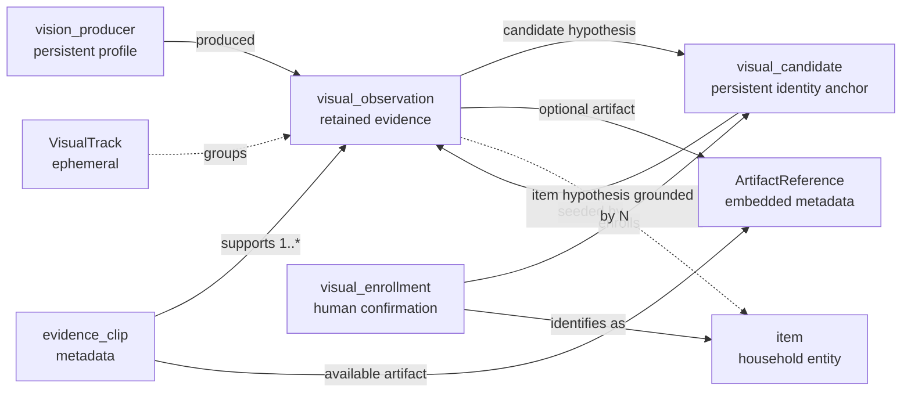
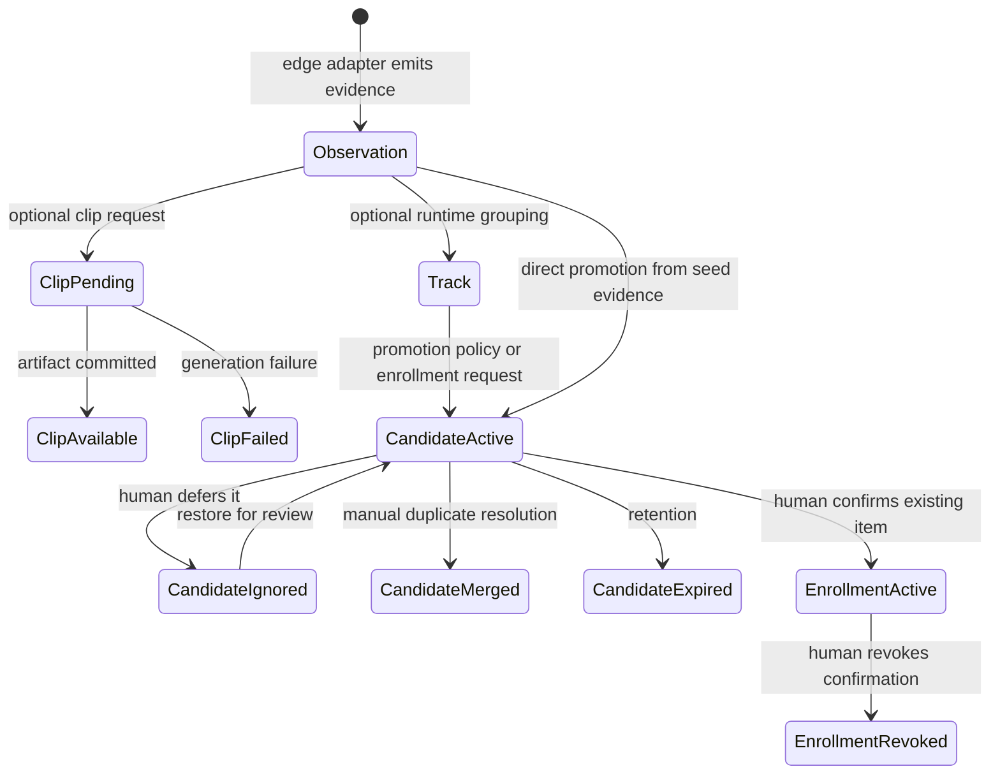

# Canonical V1 vision domain boundary

Live stream adapters (HTTP MJPEG and in-process Tapo) live under
`vision/camera/` and `vision/relay.py`. They do not create `VisualObservation`
records, clips, or identity writes.

## Decision

Home Cortex owns normalized visual evidence, durable visual identity candidates,
human-confirmed enrollment, artifact metadata, and the boundary through which
spatial estimates enter the evidence subsystem. The edge runtime owns camera
buffers, frames in flight, detector tensors and class IDs, trackers, embedding
vectors in memory, clip encoding, and vendor/model-specific post-processing.

Every detector or recognizer must adapt its output into
[`contracts.py`](contracts.py). YOLO, RT-DETR, a VLM, and a custom model therefore
produce the same Home Cortex contract. There is no detector-native union in the
domain model.

The six requested concepts do not have equal persistence or ownership:

| Concept | Canonical role | Owner | V1 persistence |
|---|---|---|---|
| `VisualObservation` | Immutable evidence that one region was reported at one time | Home Cortex evidence subsystem | Persist admitted observations; apply retention |
| `VisualTrack` | Short-lived grouping within one perception session | Edge runtime | Never a SurrealDB record |
| `VisualCandidate` | Durable identity anchor for an unknown or recognizable physical instance | Home Cortex evidence subsystem | Persist only when promoted from transient tracking/evidence |
| `EvidenceClip` | Async clip job and its metadata | Home Cortex evidence subsystem; bytes produced at edge | Persist metadata; bytes stay in artifact storage |
| `VisualEnrollment` | Auditable human confirmation from candidate to household item | Home Cortex evidence subsystem | Persist while active and retain revocation history |
| `ArtifactReference` | Immutable value describing externally stored content | Home Cortex contract; artifact store resolves it | Embed metadata in the referencing record; never store bytes |

`ProducerProfile` is an additional small persistent record. Observations refer to
one immutable profile rather than repeating pipeline and model versions. A
`TrackReference`, `DetectorBelief`, `VisualCandidateHypothesis`,
`HouseholdItemHypothesis`, bounding box, source, and optional spatial estimate are
embedded values rather than standalone records.

## Canonical model

`VisualObservation` has a `visual_observation:` ID, timezone-aware `captured_at`
and `observed_at`, device/camera source, one `DetectorBelief`, and a
`vision_producer:` reference. One observation represents one reported image
region, not an entire detector response. The box uses normalized image
coordinates with a top-left origin. The category is a generic label such as
`mug`; its confidence is detector belief.

All remaining observation fields are optional:

- `track` contains a `perception:` session ID plus an edge-local track key.
- `candidate_hypotheses` contain scored `visual_candidate:` IDs.
- `item_hypotheses` contain scored `item:` IDs and the active
  `visual_enrollment:` records that ground each machine proposal.
- `observer_pose` reuses Epic 1 `RuntimePose`.
- `object_position_estimate` requires an explicit `space:` and reuses Epic 1
  `Position` and `PoseUncertainty`.
- `artifacts` may reference crops, thumbnails, frames, or embeddings that already
  exist. Video clips use `EvidenceClip` because they have an asynchronous state.

With no localization, the canonical representation is
`observer_pose = null` and `object_position_estimate = null`. No placeholder
space, zero vector, sentinel confidence, or guessed coordinate frame is allowed.
An object estimate cannot exist without a known space.

`VisualTrack` is keyed by `(perception session, track key)`. It can collect many
observation IDs and many clip IDs, but its association decisions are runtime
state. Restarting the edge process may end a track. A track is promoted to a
`VisualCandidate` only when a durable identity anchor is useful, such as an
enrollment request or a recognition retention policy.

`VisualCandidate` uses a `visual_candidate:` ID and at least one seed observation.
Its lifecycle is `active`, `ignored`, `merged`, or `expired`. A merge names the
surviving candidate explicitly. Human confirmation is deliberately not a
candidate state. It has no `item_id`; enrollment owns that relationship. The
candidate also does not store a canonical category. Category evidence remains on
observations and can change as models improve.

`VisualEnrollment` uses a `visual_enrollment:` ID and links exactly one candidate
to exactly one existing `item:`. It records the confirming `person:`, confirmation
time, and supporting observations. An active enrollment may be revoked with a
human and timestamp. The service must enforce at most one active enrollment for
a candidate and must reject an active enrollment conflict rather than silently
choosing one. Human-confirmed item identity is a derived view:

```text
observation candidate hypothesis -> visual candidate -> active enrollment -> item
```

An observation never stores a `canonical_item_id`. Even when the derived view
resolves to an item, the recorded hypothesis and its confidence remain model
evidence, while the enrollment remains the source of human confirmation.

`ArtifactReference` contains a content-addressed `sha256:` reference, artifact
kind, MIME type, and byte length. The reference is resolved through an artifact
store interface; it contains no filesystem path, bucket name, or service URL.
This lets Mac storage and future MicroDuck or remote storage use the same domain
record. Supported V1 kinds are video clip, crop, thumbnail, frame, and embedding.

`EvidenceClip` uses an `evidence_clip:` ID and a requested time window. It is an
independent record with one or more associated observations:

- `pending`: no artifact, failure code, or resolution time;
- `available`: exactly one `video_clip` artifact reference and `resolved_at`;
- `failed`: a stable failure code, `resolved_at`, and no artifact.

One clip may support multiple observations. One observation may be supported by
multiple clip records. A track may request multiple clips. The clip is owned by
neither an observation nor a track; `observation_ids` form the durable
association. More observations may be associated while the job is pending.
Deleting or failing a clip does not invalidate, delete, or alter an observation.

`ProducerProfile` contains pipeline name/version and optional detector and
recognizer name/version pairs. Device and camera remain on `ObservationSource`
because hardware origin and model provenance answer different questions. Profiles
should be immutable and reused, with a new profile ID whenever relevant pipeline,
detector, weights, recognizer, or embedding-model version changes.

## Record relationships



These are evidence-subsystem references. They do not become concepts or relations
in `schemas/semantic/ontology.yaml`, and they do not create `located_in` edges.
A later reconciliation service may consume evidence and propose a household
mutation through the existing write boundary. That decision is outside these
contracts and must be explicit and independently auditable.

## Persistence and growth

V1 SurrealDB tables should be limited to `visual_observation`,
`visual_candidate`, `visual_enrollment`, `evidence_clip`, and `vision_producer`.
Use record references or typed fields for the relationships above; do not create
records for bounding boxes, category labels, hypotheses, track references, or
artifact-reference values.

The ingest service must apply an admission policy before persistence. It should
not turn every video frame or tracker update into a permanent observation. The
policy may retain event boundaries, meaningful changes, enrollment evidence, or
sampled observations without changing the contract. Unreferenced observations
and failed/unneeded clip metadata should have configurable retention. Records
used by an active candidate or enrollment must be pinned. Artifact garbage
collection runs separately and may remove bytes only when retention permits and
no retained metadata references them. The domain contract does not set product
specific retention durations.

## Lifecycle



Observation creation is the only mandatory step. Track creation, candidate
promotion, clip creation, spatial enrichment, recognition, and enrollment are
independent optional branches. A candidate does not turn into an item, and
enrollment does not rewrite earlier observations.

## Naming decisions and invariants

The contract uses `DetectorBelief` instead of `Detection` to keep category and
confidence visibly uncertain. `VisualCandidateHypothesis` and
`HouseholdItemHypothesis` name the two different machine claims and carry their
own scores; an item hypothesis also cites its supporting enrollments.
`observer_pose` replaces an opaque `observer` mapping. The field
`object_position_estimate` states uncertainty and requires an explicit coordinate
space. `state` is used for clip/candidate/enrollment lifecycles. Record prefixes
are subsystem-specific (`visual_observation:`, `visual_candidate:`,
`visual_enrollment:`, `evidence_clip:`, `vision_producer:`).

The following invariants are mandatory:

1. Detector-native tensors, pixel boxes, numeric class IDs, tracker objects, and
   model response payloads never cross the edge adapter.
2. A generic category, visual candidate, household item, observation, and
   enrollment are distinct values and records.
3. An observation asserts only that a producer reported evidence. It never
   asserts existence, location, confirmed identity, or a household mutation.
4. A candidate hypothesis points only to `visual_candidate:`. An item hypothesis
   is machine evidence and must cite an active supporting enrollment. Only an
   active, human-created enrollment confirms candidate-to-item identity.
5. Missing evidence is represented by absence or null. Unknown spatial state
   never uses dummy IDs or zero coordinates.
6. Spatial values reuse Epic 1 types and units. Every object position names its
   `space:` coordinate system.
7. Observation validity is independent of tracks, clips, artifacts, recognition,
   spatial estimates, and enrollment.
8. Raw media and embedding bytes never enter SurrealDB. References expose no
   storage-backend location.
9. Producer profiles are immutable; version changes create a new profile.
10. Vision records remain outside the household semantic ontology. Household
    writes require a separate explicit reconciliation action.

## Implementation guidance for Grok

1. Treat [`contracts.py`](contracts.py) as the only input boundary. Add one adapter
   per detector/runtime and discard native fields after conversion. Do not add a
   detector-specific optional field to `VisualObservation`.
2. Keep the Mac and MicroDuck capture implementations behind the same source and
   artifact-store interfaces. Their output differs only in source IDs and
   producer-profile references.
3. Persist observations only after contract validation and admission-policy
   selection. Make observation rows immutable after insertion.
4. Keep the tracker inside the edge process. Serialize only `TrackReference` on
   an admitted observation; never make downstream correctness depend on finding a
   live track.
5. Implement clip creation as an idempotent job: insert `pending`, encode/store
   bytes, then transition to `available`; on terminal error transition to
   `failed`. Commit artifact bytes before publishing `available` metadata.
6. Implement candidate promotion separately from tracking. Seed it with retained
   observations, then allow later observation hypotheses to refer to the stable
   candidate ID.
7. Require a person and existing item for enrollment. Enforce one active
   enrollment per candidate transactionally and preserve revoked records.
8. Resolve recognized item identity by joining through the active enrollment.
   Never copy the item ID into an observation as a cache; a cache may be a clearly
   labeled derived read model with invalidation on merge/revocation.
9. Add SurrealDB schema and repositories in a later persistence ticket. Keep all
   tables outside `schemas/semantic/ontology.yaml` and expose reconciliation as a
   separate application operation.
10. Add embedding generation later as an artifact producer and producer-profile
    version. Embedding vectors may be stored in a specialized index or artifact
    store; the durable identity and enrollment contracts do not change.

The production channels, delivery guarantees, clocks, device identity, replay,
and implementation ports are defined in
[`EDGE_INTERFACE.md`](EDGE_INTERFACE.md).
Human authority, candidate merge rules, missing-item creation, and the exact
household-write boundary are defined in [`ENROLLMENT.md`](ENROLLMENT.md).
The minimal live-view, observation-feed, clip-polling, and enrollment UI is
defined in [`FRONTEND.md`](FRONTEND.md).
The first implementation review is recorded in
[`artifacts/vision-architecture-review/REPORT.md`](../../../artifacts/vision-architecture-review/REPORT.md).
